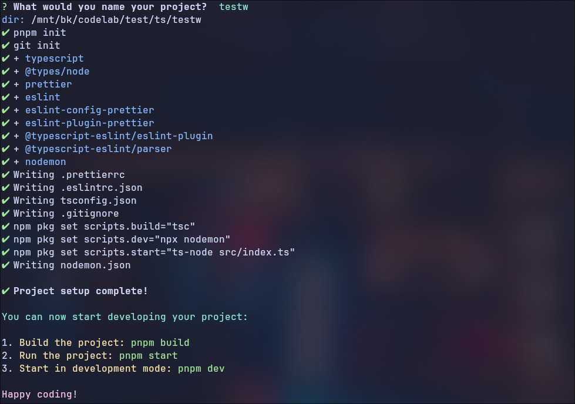

## kb-create-ts

**Install globally**

```
pnpm i kb-create-ts -g
//or
npm i kb-create-ts -g
```

**Execute with/out installing**

```
pnpx kb-create-ts
//or
npx kb-create-ts
```



**Configs and options**

- Valid flags
  - --npm
  - --pnpm
  - --default
- set default package manager

```
//<npx> kb-create-ts --default <npm>
npx kb-create-ts --default pnpm
```
